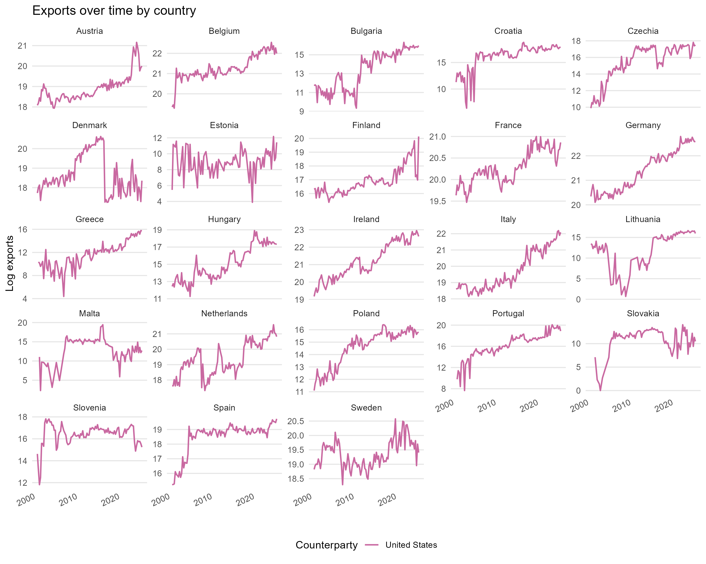
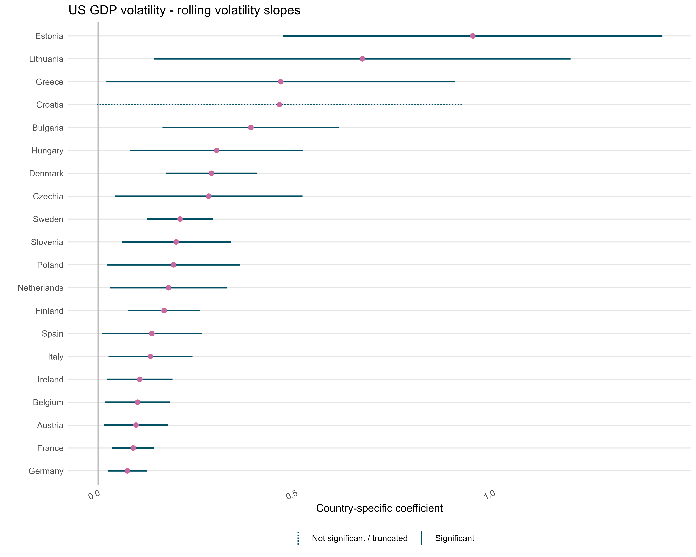
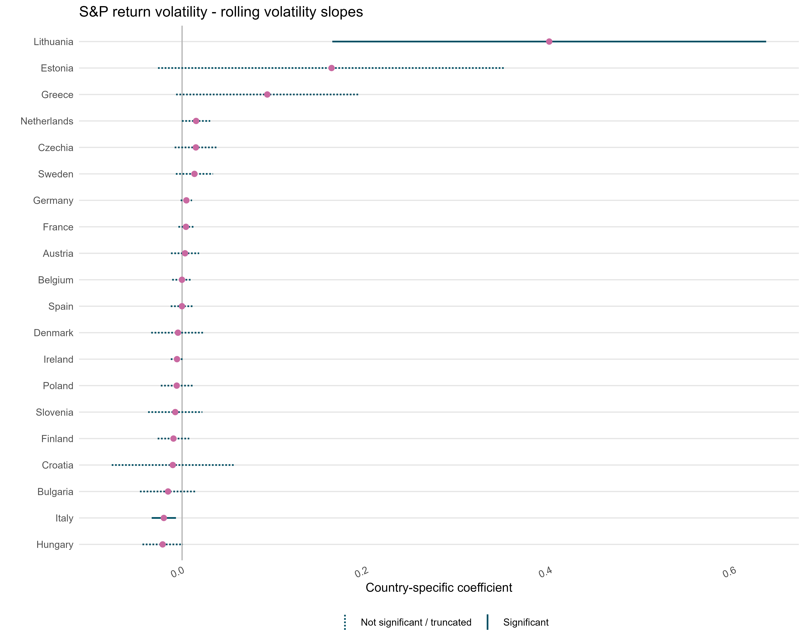
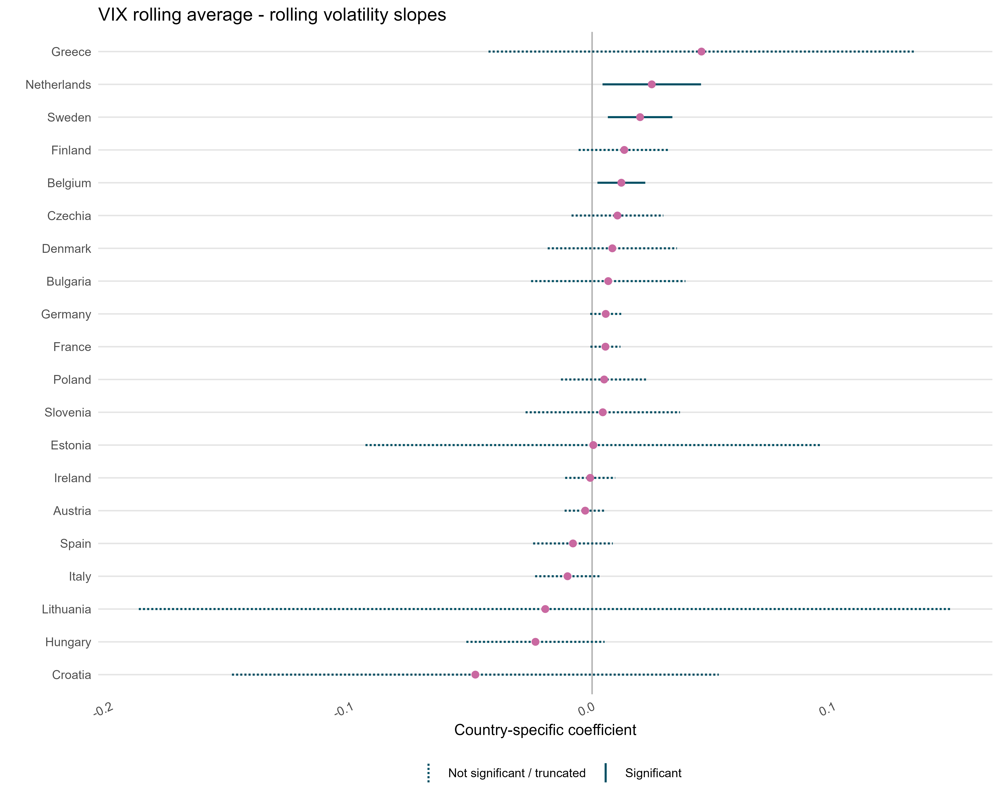
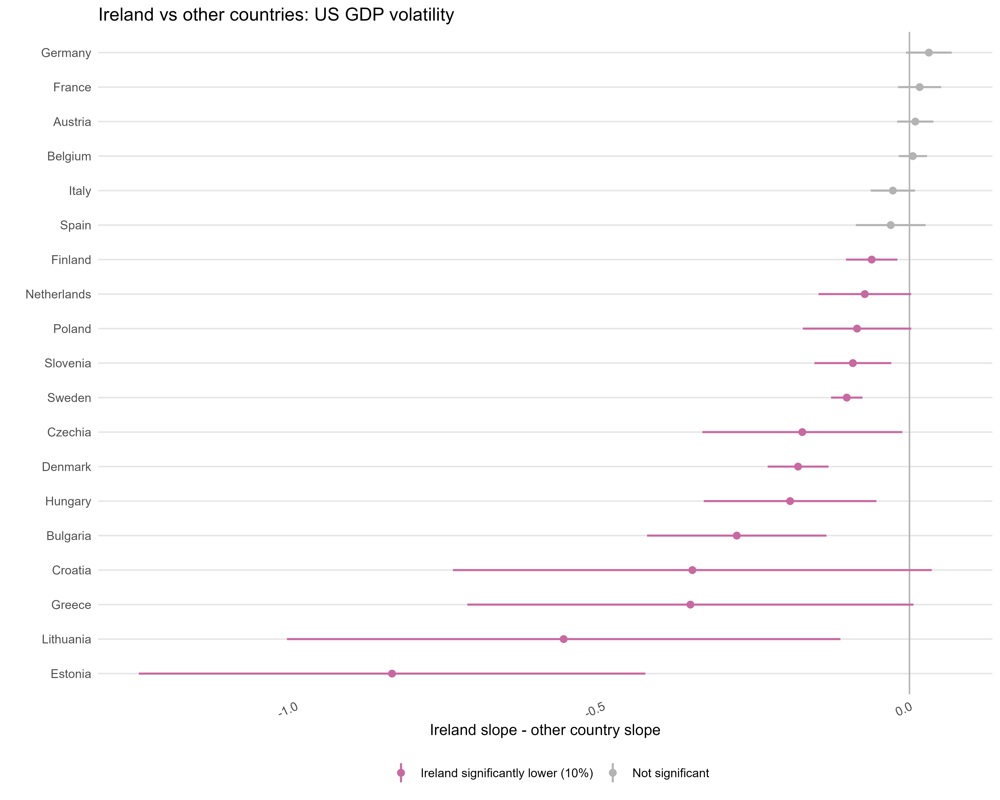
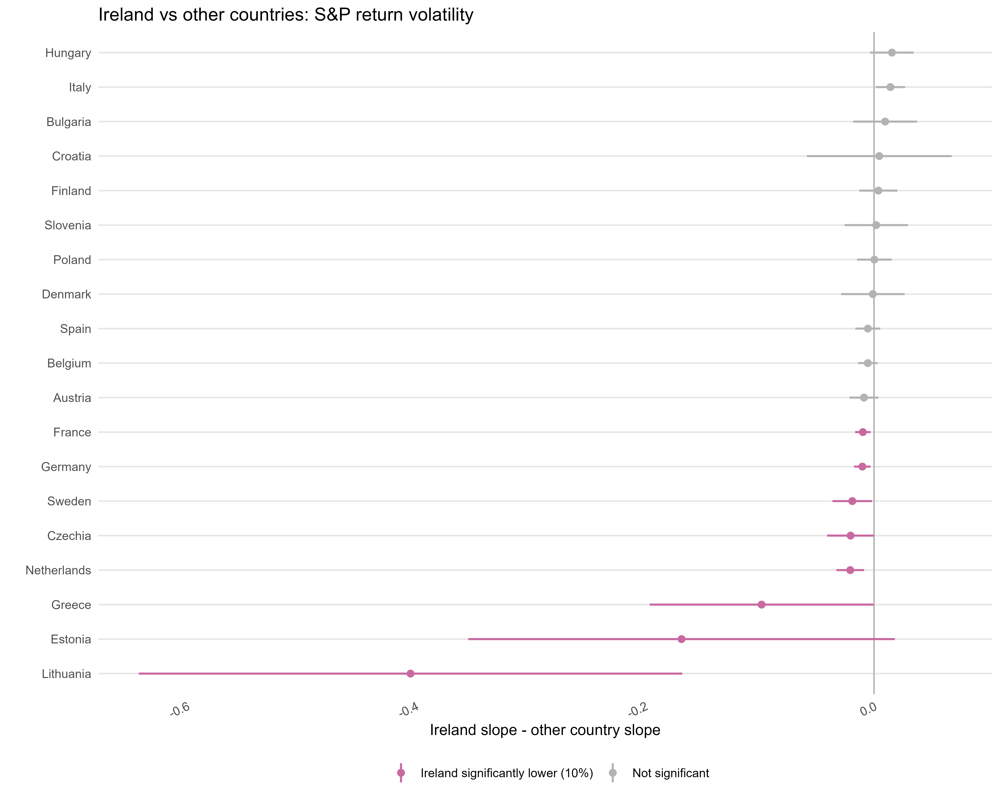
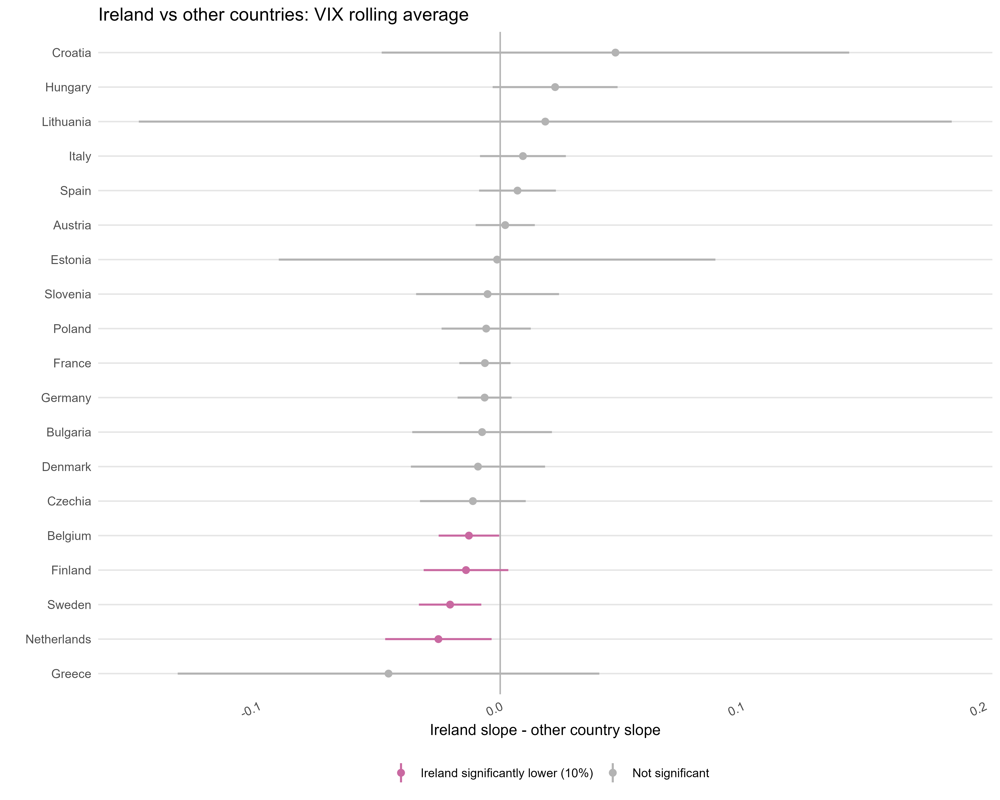

## 1. Objective


Ireland is a highly export-oriented economy, with pharmaceutical exports playing a central role in its external sector. Pharmaceutical exports are typically high-value, globally integrated, and strongly linked to multinational production networks. However, even if demand for pharmaceutical products is relatively stable, export values may still react to global financial conditions, demand shocks, and macroeconomic volatility.

This note examines whether the volatility of Ireland’s pharmaceutical exports to the United States differs from that of other European exporters facing the same global shocks. The sign and magnitude of Ireland’s sensitivity are not obvious ex ante: a large and concentrated pharmaceutical export base may amplify aggregate volatility, while long-term contracts, large multinational producers, specialized plants, and recurring export relationships with the US market may make export flows relatively stable over time. The main question is:

> Is Ireland’s pharmaceutical export performance unusually exposed to global shocks, or is it relatively stable compared with other countries?

The analysis uses quarterly pharmaceutical exports from European countries to the United States. The empirical strategy compares country-specific sensitivities to three external shock measures: US GDP volatility, S&P 500 volatility, and the rolling average of the VIX.

## 2. Data and sample construction

The dataset contains quarterly pharmaceutical exports from each European country to the United States. The export variable is total quarterly exports, denoted as:

$$
Exports_{i,t}
$$
where $i$ indexes the exporting country and $t$ indexes the quarter.

The sample starts in 2001Q1, when country coverage becomes more consistent. The analysis keeps strictly positive export observations and uses log exports, so observations with zero exports are excluded before taking logs.  Country outliers are removed based on the distribution of year-on-year export growth. The final sample includes 23 European countries.

## 3. Descriptive evidence

Figure 1 plots log pharmaceutical exports over time by country.

```{r fig-stats, echo=FALSE, out.width="100%", fig.align="center"}

```
The figure shows a generally positive trend in pharmaceutical exports across most countries, consistent with the expansion of the pharmaceutical sector and the growing importance of international production networks. It also shows substantial cross-country heterogeneity, with some episodes of marked export volatility. This motivates estimating country-specific shock sensitivities.

**Table 1. Descriptive Statistics**

```{r, echo=FALSE, results='asis', warning=FALSE, message=FALSE}
cat(readLines("2.Outcome/descriptive_statistics.html"), sep = "\n")
```

## 4. Measuring export volatility and external shocks

The main outcome is **two-year rolling export volatility**. First, quarterly export growth is computed as the quarter-to-quarter change in log pharmaceutical exports. Then, for each country, export volatility is measured as the standard deviation of quarterly export growth over the previous eight quarters.

The shock variables are constructed in the same rolling-window logic:

- **US GDP volatility**: standard deviation of quarterly US GDP growth over the previous eight quarters.
- **S&P volatility**: standard deviation of S&P 500 return over the previous eight quarters.
- **VIX rolling average**: average level of the log VIX over the previous eight quarters.

All the shock variables are standardized.

## 5. Country-specific slope model

The first empirical model estimates one shock coefficient for each country:

$$
\begin{aligned}
VolExports_{i,t}^{2y} &=
\sum_i \beta_i \left(Country_i \times Shock_t\right)
+ \alpha_i + \rho X_{i,t}+ \varepsilon_{i,t}
\end{aligned}
$$

where:

- $VolExports_{i,t}^{2y}$ is rolling two-year export volatility.
- $Shock_t$ is one of the global shock variables.
- $\alpha_i$ are country fixed effects.
- $X_{i,t}$ are country-level control variables.
- $\beta_i$ measures the country-specific sensitivity to the shock.

Controls are the ECB Harmonised Competitiveness Indicator year-on-year change, which is a real effective exchange rate measure. It captures changes in a country’s price competitiveness relative to a basket of trading partners.

**Table 2. Rolling volatility models: country-specific coefficients and diagnostics**

```{r, echo=FALSE, results='asis', warning=FALSE, message=FALSE}
cat(readLines("2.Outcome/rolling_volatility_all_models_tests.html"), sep = "\n")
```

The table reports country-specific coefficients, standard errors in parentheses, and diagnostic tests. Standard errors are corrected using Driscoll-Kraay to account for serial correlation and cross-sectional dependence in the panel.


Figures 2 to 4 show the estimated country-specific slopes.

```{r fig-globalgdp, echo=FALSE, out.width="100%",  out.height="700px", fig.align="center"}

```

```{r fig-usgdp, echo=FALSE, out.width="100%", out.height="700px", fig.align="center"}

```

```{r fig-vix, echo=FALSE, out.width="100%", out.height="700px",  fig.align="center"}

```


The confidence intervals indicate whether the estimated country-specific slopes are statistically different from zero. In most countries where the coefficients are significant, the slopes are positive. This means that higher global volatility is associated with higher volatility in pharmaceutical exports.

Ireland's estimated slope is relatively closer to zero in several specifications. This suggests that Irish pharmaceutical exports do not become highly volatile when these global shocks increase.

## 6. Slope comparisson
A second exercise directly compares Ireland’s slope with each other country’s slope. For each country (j), the tested difference is:

$$
Diff_j = \beta_{Ireland} - \beta_j
$$

The one-sided Wald-type test evaluates whether Ireland is significantly less sensitive:

$$
H_0: \beta_{Ireland} \geq \beta_j
$$

$$
H_1: \beta_{Ireland} < \beta_j
$$

The chart reports the estimated difference and a 90 percent confidence interval:

$$
Diff_j \pm 1.645 \times SE(Diff_j)
$$

```{r fig-waldus, echo=FALSE, out.width="100%", fig.align="center"}

```

```{r fig-waldgdp, echo=FALSE, out.width="100%", fig.align="center"}

```

```{r fig-waldvix, echo=FALSE, out.width="100%", fig.align="center"}

```

1. US GDP volatility: Ireland's beta is 0.106, compared with an average beta of 0.282 for the other countries. Ireland is significantly lower than 13 out of 19 countries at the 10% level.
2. S&P volatility: Ireland's beta is -0.006, compared with an average beta of 0.032 for the other countries. Ireland is significantly lower than 8 out of 19 countries at the 10% level.
3.  VIX rolling average: Ireland's beta is -0.001, compared with an average beta of 0.003 for the other countries. Ireland is significantly lower than 4 out of 19 countries at the 10% level.

## 7. Pooled versus Ireland dummy model

The second specification simplifies the heterogeneity structure. Instead of estimating one slope per country, it estimates a pooled slope and an Ireland-specific differential:

$$
VolExports_{i,t}^{2y}
=

\beta Shock_t
+
\delta
(Ireland_i \times Shock_t)
+
\alpha_i
+
\rho X_{i,t}
+
\varepsilon_{i,t}
$$

Here:

- $\beta$ is the pooled effect for the sample.
- $\delta$ is the Ireland differential.
- $\beta + \delta$ is the total Ireland effect.

This model directly answers whether Ireland is statistically different from the pooled benchmark.

**Table 3. Rolling volatility models: pooled and Ireland dummy coefficients**
```{r, echo=FALSE, results='asis', warning=FALSE, message=FALSE}
cat(readLines("2.Outcome/rolling_volatility_dummy_ireland_tests.html"), sep = "\n")
```

The Wald test evaluates whether Ireland’s differential sensitivity is statistically different from zero. The results indicate that Ireland differs significantly from the pooled benchmark for US GDP volatility and S&P return volatility, but not for the VIX rolling average.

The pooled specification confirms the pattern obtained from the country-specific Wald comparisons. While the previous exercise compares Ireland’s slope with each country-specific slope separately, this specification compares Ireland with the pooled European benchmark. The results indicate that Ireland’s pharmaceutical export volatility is less sensitive to the main global shocks than the average response in the sample. This suggests that the lower sensitivity found in the pairwise comparisons is not only driven by selected high-exposure countries, but is also visible relative to the pooled benchmark.

## 10. Conclusion

This note examines whether Ireland’s pharmaceutical exports to the United States are unusually sensitive to global macroeconomic and financial shocks. The evidence suggests that Ireland’s export volatility is not strongly amplified by global shocks when compared with other European countries.

The country-specific slope model shows substantial heterogeneity across countries. In several cases, global shocks are associated with higher pharmaceutical export volatility. Ireland’s estimated coefficients are relatively lower, suggesting that Irish pharmaceutical exports are comparatively more stable when global volatility increases.

The pairwise Ireland comparisons show that Ireland is significantly less sensitive than several individual countries. The pooled model reinforces this result: Ireland’s estimated sensitivity is lower than the average effect for the full European sample. This means that Ireland is not only less exposed than selected high-volatility countries, but also appears less sensitive than the European benchmark on average.

Overall, the results suggest that Ireland’s pharmaceutical export volatility is relatively resilient. The evidence does not support the concern that Ireland’s high pharmaceutical concentration translates into stronger sensitivity to global shocks; instead, long-term contracts and recurring export relationships may help smooth export flows.
